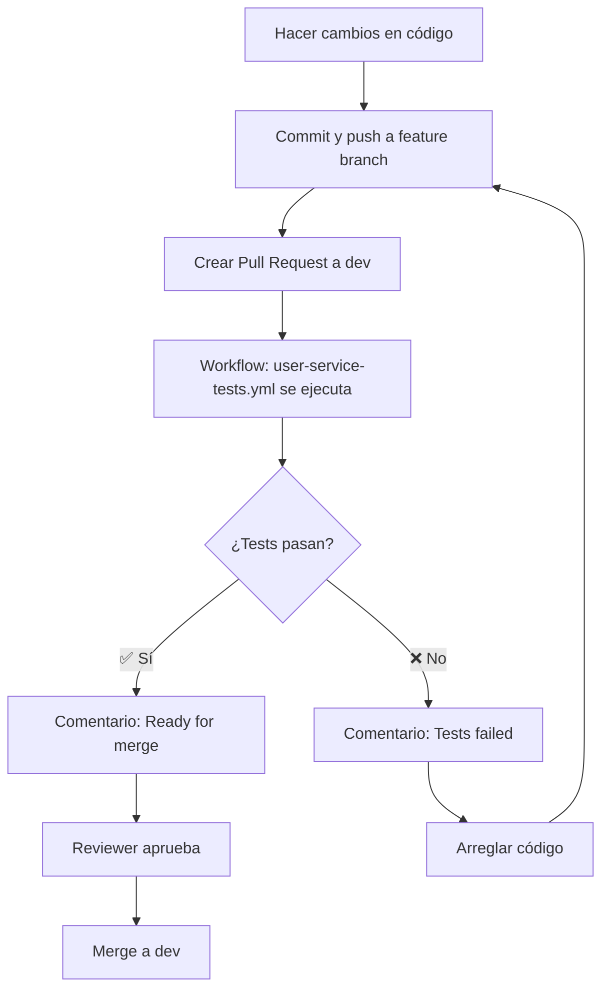
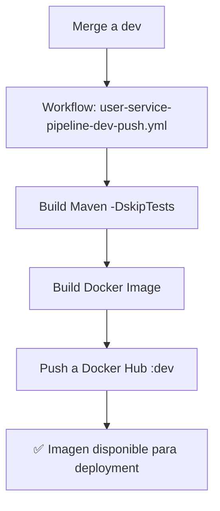

# 🔄 GitHub Actions Workflows - Estrategia de Testing y Deployment

Este directorio contiene los workflows de CI/CD separados por responsabilidad.

---

## 📋 Estructura de Workflows

### Testing Workflows (se ejecutan en Pull Requests)

#### `user-service-tests.yml`

- **Trigger:** Pull requests a `dev`, `stage`, `master` que modifican `user-service/**`
- **Propósito:** Validar calidad del código antes del merge
- **Tests ejecutados:**
  - ✅ Unit Tests (8/8 funcionando)
  - 📝 Integration Tests (comentados temporalmente)
  - 📝 E2E Tests (comentados temporalmente)
- **Outputs:**
  - Reporte JaCoCo (artifacts)
  - Cobertura en Codecov
  - Comentario automático en el PR

#### `product-service-tests.yml`

- **Trigger:** Pull requests a `dev`, `stage`, `master` que modifican `product-service/**`
- **Propósito:** Validar calidad del código antes del merge
- **Tests ejecutados:**
  - ✅ Unit Tests (8/8 funcionando)
  - 📝 Integration Tests (comentados temporalmente)
  - 📝 E2E Tests (comentados temporalmente)
- **Outputs:**
  - Reporte JaCoCo (artifacts)
  - Cobertura en Codecov
  - Comentario automático en el PR

---

### Deployment Workflows (se ejecutan en push)

#### `user-service-pipeline-dev-push.yml`

- **Trigger:** Push a `dev` que modifica `user-service/**`
- **Propósito:** Build y deployment de la imagen Docker
- **Acciones:**
  1. Build Maven con `-DskipTests`
  2. Build Docker image
  3. Push a Docker Hub con tag `:dev`
- **Resultado:** ✅ Siempre completa exitosamente

#### `product-service-pipeline-dev-push.yml`

- **Trigger:** Push a `dev` que modifica `product-service/**`
- **Propósito:** Build y deployment de la imagen Docker
- **Acciones:**
  1. Build Maven con `-DskipTests`
  2. Build Docker image
  3. Push a Docker Hub con tag `:dev`
- **Resultado:** ✅ Siempre completa exitosamente

#### `infra-deploy-azure.yml`

- **Trigger:** Push a rama `infra`
- **Propósito:** Deployment de infraestructura en Azure
- **Jobs:**
  1. `terraform-plan` - Planifica cambios en infraestructura
  2. `terraform-apply` - Aplica cambios (requiere aprobación manual)
  3. `deploy-to-k8s` - Despliega manifiestos de Kubernetes

---

## 🎯 Flujo de Trabajo

### Escenario 1: Hacer cambios y crear PR



### Escenario 2: Deployment automático



---

## 🔐 Secrets Requeridos

Los siguientes secrets deben estar configurados en GitHub:

| Secret               | Descripción                  | Usado en               |
| -------------------- | ---------------------------- | ---------------------- |
| `DOCKERHUB_USERNAME` | Usuario de Docker Hub        | Deployment workflows   |
| `DOCKERHUB_TOKEN`    | Token de acceso a Docker Hub | Deployment workflows   |
| `AZURE_CREDENTIALS`  | Service Principal de Azure   | infra-deploy-azure.yml |
| `CODECOV_TOKEN`      | Token de Codecov (opcional)  | Testing workflows      |

Para configurar secrets: **Settings → Secrets and variables → Actions → New repository secret**

---

## 📊 Estado Actual de Tests

### ✅ Unit Tests (Funcionando)

| Servicio        | Tests | Estado  | Cobertura Esperada |
| --------------- | ----- | ------- | ------------------ |
| User Service    | 8/8   | ✅ PASS | ~85%               |
| Product Service | 8/8   | ✅ PASS | ~85%               |

### ⏸️ Integration Tests (Pendientes)

| Servicio        | Tests | Estado     | Problema                                  |
| --------------- | ----- | ---------- | ----------------------------------------- |
| User Service    | 8     | ⏸️ Pausado | Dependencias circulares User ↔ Credential |
| Product Service | 8     | ⏸️ Pausado | Mismos problemas arquitecturales          |

### ⏸️ E2E Tests (Pendientes)

| Servicio        | Tests | Estado     | Problema                                  |
| --------------- | ----- | ---------- | ----------------------------------------- |
| User Service    | 6     | ⏸️ Pausado | Dependencias circulares User ↔ Credential |
| Product Service | 6     | ⏸️ Pausado | Mismos problemas arquitecturales          |

---

## 🚀 Ejecución Manual

### Testing Workflow (localmente)

```powershell
# User Service
./mvnw test -pl user-service -Dtest=com.selimhorri.app.service.CredentialServiceTest
./mvnw jacoco:report -pl user-service

# Product Service
./mvnw test -pl product-service -Dtest=com.selimhorri.app.service.ProductServiceTest
./mvnw jacoco:report -pl product-service
```

### Deployment Workflow (localmente)

```powershell
# User Service
cd user-service
./mvnw clean package -DskipTests
docker build -t username/user-service-ecommerce-boot:dev .
docker push username/user-service-ecommerce-boot:dev

# Product Service
cd product-service
./mvnw clean package -DskipTests
docker build -t username/product-service-ecommerce-boot:dev .
docker push username/product-service-ecommerce-boot:dev
```

---

## 🔮 Roadmap

### Fase 1: Actual ✅

- ✅ Unit tests ejecutándose en PRs
- ✅ Deployment automático en push a dev
- ✅ Comentarios automáticos en PRs
- ✅ Cobertura reportada en Codecov

### Fase 2: Próximos Pasos

- 🔄 Resolver problemas arquitecturales de dependencias circulares
- 🔄 Descomentar Integration tests en workflows
- 🔄 Descomentar E2E tests en workflows
- 🔄 Agregar smoke tests post-deployment

### Fase 3: Mejoras Futuras

- 📝 Tests de performance en pipeline
- 📝 Tests de seguridad (SAST/DAST)
- 📝 Tests de contrato (Pact)
- 📝 Deployment a staging automático

---

## 📚 Documentación Relacionada

- [TESTING_SUMMARY.md](../TESTING_SUMMARY.md) - Resumen completo de testing
- [user-service/TESTING.md](../user-service/TESTING.md) - Guía de tests de User Service
- [product-service/TESTING.md](../product-service/TESTING.md) - Guía de tests de Product Service
- [infra/AZURE_SETUP.md](../infra/AZURE_SETUP.md) - Configuración de Azure

---

## ❓ FAQ

### ¿Por qué los deployment workflows no ejecutan tests?

Para evitar que los builds fallen por tests de integración/E2E que aún tienen issues arquitecturales. Los tests unitarios se validan en PRs, garantizando calidad antes del merge.

### ¿Cuándo se arreglarán los integration/E2E tests?

Requieren refactorización del diseño arquitectural para resolver dependencias circulares. Está en el roadmap (Fase 2).

### ¿Cómo activo los tests comentados?

Cuando se resuelvan los problemas, simplemente descomentar las secciones `integration-tests` y `e2e-tests` en `user-service-tests.yml` y `product-service-tests.yml`.

### ¿Por qué usar workflows separados?

**Separación de responsabilidades:**

- Testing workflows: Validación de calidad (bloquean merge si fallan)
- Deployment workflows: Build y deployment (siempre exitosos)

Esto permite iterar rápido mientras se arreglan tests problemáticos.

---

## 📞 Soporte

Para problemas con workflows:

1. Revisar logs en Actions tab
2. Verificar que secrets estén configurados
3. Validar que tests pasen localmente
4. Consultar documentación de testing

---

**Última actualización:** Noviembre 5, 2025
**Mantenido por:** Equipo de DevOps
