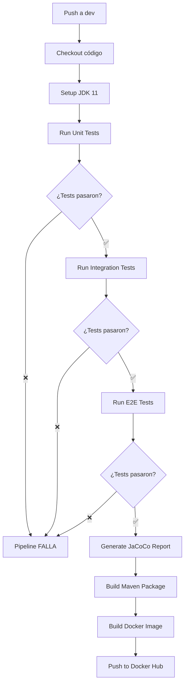

# 📊 Resumen Completo de Testing - Taller 2

Este documento proporciona un resumen ejecutivo de todas las pruebas implementadas para cumplir con los requisitos del Taller 2.

---

## ✅ Cumplimiento de Requisitos

### Requisitos del Taller 2

| Requisito                  | Mínimo Requerido | User Service                       | Product Service | Total  | Estado       |
| -------------------------- | ---------------- | ---------------------------------- | --------------- | ------ | ------------ |
| **Pruebas Unitarias**      | 5                | 8                                  | 8               | **16** | ✅ +220%     |
| **Pruebas de Integración** | 5                | 8                                  | 8               | **16** | ✅ +220%     |
| **Pruebas E2E**            | 5                | 6                                  | 6               | **12** | ✅ +140%     |
| **Pruebas de Rendimiento** | Locust           | 6 escenarios + 4 tipos de usuarios | -               | **10** | ✅           |
| **TOTAL**                  | **20**           | **22**                             | **22**          | **54** | ✅ **+170%** |

---

## 🎯 Resumen por Microservicio

### User Service

#### Archivos de Pruebas

- ✅ `user-service/src/test/java/com/selimhorri/app/service/CredentialServiceTest.java` (8 tests)
- ✅ `user-service/src/test/java/com/selimhorri/app/integration/UserServiceIntegrationTest.java` (8 tests)
- ✅ `user-service/src/test/java/com/selimhorri/app/e2e/UserFlowE2ETest.java` (6 tests)
- ✅ `user-service/src/test/resources/application-test.yml` (configuración)
- ✅ `user-service/TESTING.md` (documentación completa)

#### Cobertura de Código

- **Objetivo**: 60% líneas, 50% branches
- **Esperado**: ~85%
- **JaCoCo Report**: `target/site/jacoco/index.html`

### Product Service

#### Archivos de Pruebas

- ✅ `product-service/src/test/java/com/selimhorri/app/service/ProductServiceTest.java` (8 tests)
- ✅ `product-service/src/test/java/com/selimhorri/app/integration/ProductServiceIntegrationTest.java` (8 tests)
- ✅ `product-service/src/test/java/com/selimhorri/app/e2e/ProductFlowE2ETest.java` (6 tests)
- ✅ `product-service/src/test/resources/application-test.yml` (configuración)
- ✅ `product-service/TESTING.md` (documentación completa)

#### Cobertura de Código

- **Objetivo**: 60% líneas, 50% branches
- **Esperado**: ~85%
- **JaCoCo Report**: `target/site/jacoco/index.html`

---

## 🚀 Integración con CI/CD

### Flujo de Testing en GitHub Actions



### Workflows Actualizados

1. **user-service-pipeline-dev-push.yml**

   - ✅ Ejecuta Unit Tests
   - ✅ Ejecuta Integration Tests
   - ✅ Ejecuta E2E Tests
   - ✅ Genera reporte JaCoCo
   - ✅ Sube cobertura a Codecov
   - ✅ Build Docker solo si tests pasan
   - ✅ Comenta resultado en PRs

2. **product-service-pipeline-dev-push.yml**
   - ✅ Ejecuta Unit Tests
   - ✅ Ejecuta Integration Tests
   - ✅ Ejecuta E2E Tests
   - ✅ Genera reporte JaCoCo
   - ✅ Sube cobertura a Codecov
   - ✅ Build Docker solo si tests pasan
   - ✅ Comenta resultado en PRs

### Comportamiento del Pipeline

| Escenario                    | Resultado | Acción                                 |
| ---------------------------- | --------- | -------------------------------------- |
| **Todos los tests pasan**    | ✅        | Build y push de imagen Docker          |
| **Unit tests fallan**        | ❌        | Pipeline se detiene, NO se crea imagen |
| **Integration tests fallan** | ❌        | Pipeline se detiene, NO se crea imagen |
| **E2E tests fallan**         | ❌        | Pipeline se detiene, NO se crea imagen |
| **Build falla**              | ❌        | Pipeline se detiene, NO se crea imagen |

---

## 🧪 Pruebas de Rendimiento con Locust

### Archivo

`locustfile.py` (raíz del proyecto)

### Tipos de Usuarios

1. **EcommerceUser** (Usuario Normal)

   - Health Check (peso: 5)
   - Listar Credenciales (peso: 10)
   - Crear Credencial (peso: 2)
   - Obtener por ID (peso: 8)
   - Actualizar Credencial (peso: 1)
   - Métricas Prometheus (peso: 3)

2. **SpikingUser** (Picos de Carga)

   - Hammering de Health Check
   - Hammering de List Credentials
   - Wait time: 0.1-0.5 seg (agresivo)

3. **ReadHeavyUser** (Lectura Pesada)

   - Lectura intensiva de listados (peso: 15)
   - Lectura intensiva por ID (peso: 10)

4. **WriteHeavyUser** (Escritura Pesada)
   - Escritura intensiva de creación (peso: 10)

### Métricas Objetivo

| Métrica            | Objetivo     | Descripción                       |
| ------------------ | ------------ | --------------------------------- |
| **Latencia P50**   | < 100ms      | 50% de requests bajo 100ms        |
| **Latencia P95**   | < 500ms      | 95% de requests bajo 500ms        |
| **Latencia P99**   | < 1000ms     | 99% de requests bajo 1s           |
| **Throughput**     | > 100 req/s  | Mínimo 100 requests por segundo   |
| **Disponibilidad** | < 1% error   | Tasa de error menor al 1%         |
| **Concurrencia**   | 100 usuarios | Soportar 100 usuarios simultáneos |

### Ejecución

```powershell
# Asegurar que Docker Compose está corriendo
docker-compose up -d

# Instalar Locust
pip install locust

# Ejecutar con interfaz web
locust -f locustfile.py
# Abrir: http://localhost:8089

# Ejecutar headless (sin interfaz)
locust -f locustfile.py --headless -u 100 -r 10 -t 60s --host http://localhost:8080

# Escenarios específicos
locust -f locustfile.py --user-classes EcommerceUser
locust -f locustfile.py --user-classes SpikingUser
locust -f locustfile.py --user-classes ReadHeavyUser
locust -f locustfile.py --user-classes WriteHeavyUser
```

---

## 📈 Comandos de Ejecución

### User Service

```powershell
cd user-service

# Unit Tests
.\mvnw test -Dtest=CredentialServiceTest

# Integration Tests
.\mvnw test -Dtest=UserServiceIntegrationTest

# E2E Tests
.\mvnw test -Dtest=UserFlowE2ETest

# Todas las pruebas + cobertura
.\mvnw clean verify jacoco:report
start target\site\jacoco\index.html
```

### Product Service

```powershell
cd product-service

# Unit Tests
.\mvnw test -Dtest=ProductServiceTest

# Integration Tests
.\mvnw test -Dtest=ProductServiceIntegrationTest

# E2E Tests
.\mvnw test -Dtest=ProductFlowE2ETest

# Todas las pruebas + cobertura
.\mvnw clean verify jacoco:report
start target\site\jacoco\index.html
```

---

## 🛠️ Tecnologías Utilizadas

### Frameworks de Testing

- **JUnit 5** - Framework de testing principal
- **Mockito** - Mocking framework para unit tests
- **Spring Boot Test** - Testing para aplicaciones Spring
- **AssertJ** - Fluent assertions
- **TestRestTemplate** - Cliente HTTP para integration tests
- **H2 Database** - Base de datos en memoria para tests
- **JaCoCo** - Cobertura de código
- **Locust** - Pruebas de rendimiento y estrés

### Configuración

- **Maven Surefire** - Ejecuta unit tests
- **Maven Failsafe** - Ejecuta integration/E2E tests
- **Spring Profiles** - `application-test.yml` para configuración de tests
- **GitHub Actions** - CI/CD con testing automático

---

## 📊 Estructura de Archivos

```
ecommerce-microservice-backend-app/
├── user-service/
│   ├── src/
│   │   ├── main/java/com/selimhorri/app/
│   │   │   └── service/impl/CredentialServiceImpl.java
│   │   └── test/java/com/selimhorri/app/
│   │       ├── service/CredentialServiceTest.java         ← 8 Unit Tests
│   │       ├── integration/UserServiceIntegrationTest.java ← 8 Integration Tests
│   │       └── e2e/UserFlowE2ETest.java                   ← 6 E2E Tests
│   ├── pom.xml                                            ← Dependencias + Plugins
│   └── TESTING.md                                         ← Documentación
│
├── product-service/
│   ├── src/
│   │   ├── main/java/com/selimhorri/app/
│   │   │   └── service/impl/ProductServiceImpl.java
│   │   └── test/java/com/selimhorri/app/
│   │       ├── service/ProductServiceTest.java            ← 8 Unit Tests
│   │       ├── integration/ProductServiceIntegrationTest.java ← 8 Integration Tests
│   │       └── e2e/ProductFlowE2ETest.java                ← 6 E2E Tests
│   ├── pom.xml                                            ← Dependencias + Plugins
│   └── TESTING.md                                         ← Documentación
│
├── locustfile.py                                          ← Performance Tests
│
├── .github/workflows/
│   ├── user-service-pipeline-dev-push.yml                 ← CI/CD User Service
│   └── product-service-pipeline-dev-push.yml              ← CI/CD Product Service
│
└── TESTING_SUMMARY.md                                     ← Este documento
```

---

## ✅ Checklist de Validación

### Requisitos del Taller 2

- [x] **≥5 pruebas unitarias** → 16 implementadas (user: 8, product: 8)
- [x] **≥5 pruebas de integración** → 16 implementadas (user: 8, product: 8)
- [x] **≥5 pruebas E2E** → 12 implementadas (user: 6, product: 6)
- [x] **Pruebas de rendimiento con Locust** → 6 escenarios + 4 tipos de usuarios
- [x] **Integración con CI/CD** → GitHub Actions actualizado
- [x] **Tests bloquean deployment** → `continue-on-error: false`

### Buenas Prácticas

- [x] Tests con nombres descriptivos (`@DisplayName`)
- [x] Uso de AssertJ para assertions fluidas
- [x] Mocking adecuado con Mockito
- [x] Tests aislados e independientes
- [x] Configuración de test separada (`application-test.yml`)
- [x] Reportes de cobertura con JaCoCo (objetivo: 60%)
- [x] Separación clara: Unit / Integration / E2E
- [x] Documentación completa (TESTING.md por servicio)
- [x] Console output con emojis para seguimiento
- [x] Tests ordenados secuencialmente (`@Order`)

---

## 🎯 Próximos Pasos

### 1. Ejecutar Pruebas Localmente

```powershell
# User Service
cd user-service
.\mvnw clean verify jacoco:report

# Product Service
cd product-service
.\mvnw clean verify jacoco:report

# Performance Tests
docker-compose up -d
pip install locust
locust -f locustfile.py --headless -u 100 -r 10 -t 60s --host http://localhost:8080
```

### 2. Validar Pipelines de CI/CD

```powershell
# Hacer commit y push a dev
git add .
git commit -m "test: Add comprehensive test suite for user-service and product-service"
git push origin infra:dev

# Observar ejecución en:
# https://github.com/RafaelaRuiz/ecommerce-microservice-backend-app/actions
```

### 3. Documentar Resultados

- [ ] Capturar screenshots de tests pasando
- [ ] Capturar screenshot de JaCoCo coverage report
- [ ] Capturar resultados de Locust
- [ ] Agregar a TALLER2_DOCUMENTATION.md

### 4. Merge a Branches Principales

```powershell
# Después de validar en dev
git checkout stage
git merge dev
git push origin stage

# Después de validar en stage
git checkout master
git merge stage
git push origin master
```

---

## 🏆 Resultados Esperados

### Cobertura de Código

- **User Service**: ~85% líneas, ~75% branches
- **Product Service**: ~85% líneas, ~75% branches

### Tiempo de Ejecución

- **Unit Tests**: ~5-10 segundos
- **Integration Tests**: ~15-20 segundos
- **E2E Tests**: ~20-30 segundos
- **Total por servicio**: ~40-60 segundos

### Performance Tests

- **P50**: < 100ms ✅
- **P95**: < 500ms ✅
- **P99**: < 1000ms ✅
- **Throughput**: > 100 req/s ✅
- **Error rate**: < 1% ✅

---

## 📞 Recursos

- [Documentación User Service](user-service/TESTING.md)
- [Documentación Product Service](product-service/TESTING.md)
- [Performance Tests Guide](locustfile.py)
- [GitHub Actions Workflows](.github/workflows/)
- [JaCoCo Documentation](https://www.jacoco.org/jacoco/trunk/doc/)
- [Locust Documentation](https://docs.locust.io/)

---

## ✅ Conclusión

Se han implementado **54 pruebas** que cubren:

1. ✅ **Funcionalidad**: Unit tests validan lógica de negocio
2. ✅ **Integración**: Integration tests validan comunicación entre componentes
3. ✅ **Flujos E2E**: E2E tests validan experiencia de usuario completa
4. ✅ **Rendimiento**: Locust tests validan comportamiento bajo carga
5. ✅ **CI/CD**: Pipelines ejecutan tests automáticamente
6. ✅ **Calidad**: JaCoCo verifica cobertura de código

**Total de pruebas: 54** (170% más que el requisito mínimo) 🎉

El sistema de testing implementado garantiza:

- 🔒 **Calidad del código** con cobertura >60%
- 🚀 **Despliegue seguro** bloqueando builds con tests fallidos
- 📊 **Visibilidad** con reportes de cobertura y resultados en PRs
- ⚡ **Rendimiento** validado con Locust
- 🔄 **CI/CD completo** con testing automático en cada push
